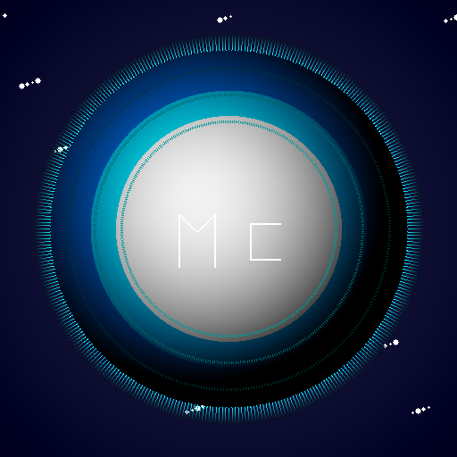

# 🚀 MotionCore - Terraform Your Planet

<div align="center">



**Uzay temalı, minimalist ve fütüristik bir Flutter mobil uygulaması**

[](https://flutter.dev)
[](https://dart.dev)
[](LICENSE)

</div>

## 📱 Hakkında

MotionCore, kullanıcıların günlük adımlarını takip ederek gezegen terraform etmelerini sağlayan bir fitness gamification uygulamasıdır. Her adımınız enerjiye dönüşür ve bu enerjiyi kullanarak ölü bir gezegeni yaşanabilir bir dünyaya dönüştürebilirsiniz.

## ✨ Özellikler

### 🌍 Terraforming Sistemi
- **3 Faz**: Dead Rock → Blue Hope → Green Eden
- **3 Kaynak**: Hydrosphere (Su), Atmosphere (Hava), Biosphere (Yaşam)
- **Gerçekçi Animasyonlar**: Her faz için özel gezegen görselleştirmeleri

### 📊 İstatistikler
- Günlük adım takibi
- Haftalık progress grafikleri
- Toplam enerji ve terraforming ilerlemesi

### 🎯 Mission Sistemi
- Günlük görevler (5,000 adım, 1,000 enerji)
- Stage progression görevleri
- Ödül sistemi

### 🛒 Market
- Enerji boost'ları (Step Multiplier x2, Energy Bonus +50%)
- Gezegen özelleştirmeleri (Neon Glow, Particle Effects, Custom Colors)

### 🎨 UI/UX
- Dark theme (Uzay temalı)
- Neon efektler ve glassmorphism
- Smooth animasyonlar
- Responsive tasarım

## 🛠️ Teknolojiler

- **Flutter** 3.0+
- **Dart** 3.0+
- **Provider** - State Management
- **Pedometer** - Adım sayma
- **SharedPreferences** - Local Storage
- **Google Fonts** - Custom Fontlar (Orbitron, Exo 2)

## 📦 Kurulum

### Gereksinimler
- Flutter SDK (3.0.0+)
- Dart SDK
- Android Studio (Android için)
- Xcode (iOS için - macOS'ta)

### Adımlar

1. **Repository'yi clone edin**
```bash
git clone https://github.com/huseyindemirok/motioncore.git
cd motioncore
```

2. **Dependencies'leri yükleyin**
```bash
flutter pub get
```

3. **Uygulamayı çalıştırın**
```bash
flutter run
```

## 📱 Ekranlar

- **Dashboard**: Gezegen durumu, kinetic potential, harvest energy
- **Terraforming Console**: Enerji dağıtımı ve terraforming
- **Missions**: Günlük ve stage progression görevleri
- **Statistics**: Adım ve progress istatistikleri
- **Market**: Boost ve özelleştirme satın alma

## 🎮 Nasıl Oynanır?

1. **Adım Atın**: Her adımınız 1 enerji birimine dönüşür
2. **Enerji Toplayın**: "HARVEST ENERGY" butonuna tıklayın
3. **Terraform Edin**: Terraforming Console'da enerjinizi gezegen kaynaklarına dağıtın
4. **Görevleri Tamamlayın**: Mission'ları tamamlayarak bonus enerji kazanın
5. **Gezegeni Geliştirin**: Dead Rock → Blue Hope → Green Eden

## 📸 Ekran Görüntüleri

*(Ekran görüntüleri eklenecek)*

## 🤝 Katkıda Bulunma

Katkılarınızı bekliyoruz! Lütfen:

1. Fork edin
2. Feature branch oluşturun (`git checkout -b feature/amazing-feature`)
3. Commit edin (`git commit -m 'feat: amazing feature eklendi'`)
4. Push edin (`git push origin feature/amazing-feature`)
5. Pull Request açın

## 📄 Lisans

Bu proje MIT lisansı altında lisanslanmıştır.

## 👨‍💻 Geliştirici

**Hüseyin Demirok**
- GitHub: [@huseyindemirok](https://github.com/huseyindemirok)

## 🙏 Teşekkürler

- Flutter ekibine
- Tüm açık kaynak paket geliştiricilerine
- Test edenlere ve geri bildirim verenlere

---

<div align="center">

**⭐ Beğendiyseniz yıldız vermeyi unutmayın! ⭐**

Made with ❤️ using Flutter

</div>
